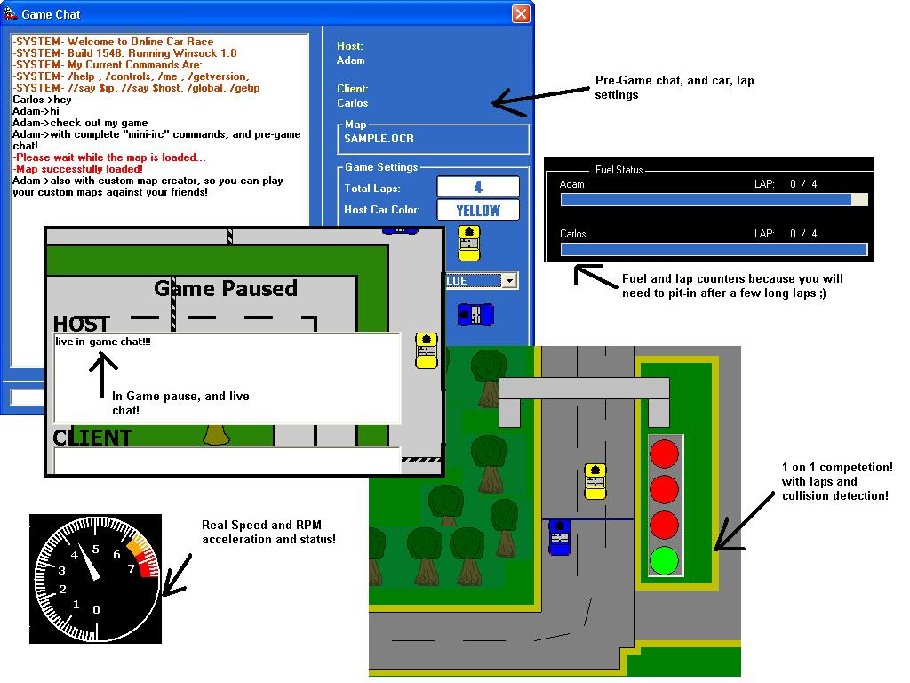



## Online Car Race \- AMAZING\!\! Best Online Car Race Game EVER \+ Custom Map Editor \-UPDATE UPDATE\!

### Description

This is a game I have been working on for the past 3 months when I have spare time.. It features a 1 on 1 game environment, complete with a mini-irc chat, and a CUSTOM MAP EDITOR! With that, you can make your custom maps, send them to your friend, and play online! It also sets your keyboard repeat rate, so that every game will be a fair round. I hope this wins Code of the Month Award!!! The only thing I did not make, was the RPM meter, although I do not have credits for that person, because I cannot find who created it... Please msg me if you made it ;) UPDATED FOR THE MONTH OF APRIL FOR WHICH I HOPE TO WIN CODE OF THE MONTH! :) PLEASE VOTE!!
 
### More Info
 

             |
---                |---
**Submitted On**   |2002-03-31 15:26:30
**By**             |[Adam Szabo](https://github.com/Planet-Source-Code/PSCIndex/blob/master/ByAuthor/adam-szabo.md)
**Level**          |Advanced
**User Rating**    |3.9 (67 globes from 17 users)
**Compatibility**  |VB 5\.0, VB 6\.0
**Category**       |[Games](https://github.com/Planet-Source-Code/PSCIndex/blob/master/ByCategory/games__1-38.md)
**World**          |[Visual Basic](https://github.com/Planet-Source-Code/PSCIndex/blob/master/ByWorld/visual-basic.md)
**Archive File**   |[Online\_Car67285412002\.zip](https://github.com/Planet-Source-Code/adam-szabo-online-car-race-amazing-best-online-car-race-game-ever-custom-map-editor-update__1-33272/archive/master.zip)

